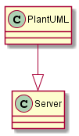

# mdBook PlantUML

> Release candidate. Please report any issues you find.

mdBook preprocessor to render [PlantUML](http://plantuml.com/) code blocks as images in your book.

## Contents
- [Usage](#usage)
- [Configuration options](#options)
- [Server configuration](#example-server-configuration)
- [Troubleshooting rendering issues](#troubleshooting-rendering-issues)
- [Change log](#change-log)
- [Building/installing on Linux](#building-and-installing-on-linux)

## Usage

First create the preprocessor in your book.toml file:
```toml
[book]
authors = ["Dzjengis Khan"]
multilingual = false
src = "src"
title = "mdBook PlantUML preprocessor"

[preprocessor.plantuml]
plantuml-cmd="plantuml.jar"  # or plantuml, or /usr/bin/plantuml, /usr/local/bin/plantuml, etc...

The above assumes both the mdbook-preprocessor and the plantuml executable/jar file are on your path.

Then simply add a PlantUML code block in your book text:

````markdown
Some text here


Some more text.
````

The plantuml code block will be replaced an image reference to an SVG image if
possible, or png if PlantUML does not support svg for the requested diagram type
(i.e. ditaa).

## Image formats
The image is svg, or png by default, depending on the diagram type. If desired it can be changed to another one of PlantUMLs output formats (note that some formats are not supported by all browsers and or PlantUML server implementations).

See https://plantuml.com/command-line (Types of Output File) for available formats. mdbook-plantuml uses the short param name (case sensitive, without the '-')

````markdown
A diagram in UTF-8 text format (inlined automatically)


Force png format:

````

## Options
- **plantuml-cmd:** Optional command override for PlantUML (defaults to "java -jar plantuml.jar" on Windows and "/usr/bin/plantuml" on Linux).
  When a URL is provided it is assumed you want to generate the images using a PlantUML server implementation.
- **clickable-img:** Optional (```false``` by default). When ```true``` images can be clicked and are opened in a new tab/window.
- **use-data-uris:** Optional (```true``` by default). When ```true``` images are rendered as inline Data URIs (not requiring external files).
- **piped:** Optional (```true``` by default). When ```true``` plantuml (shell only) is executed in piped mode, enabling the use of `!include` and `!includesub` directives in PlantUML.
- **fail-on-error:** Optional (```false``` by default). When ```true``` any rendering error will cause the preprocessor to fail and the book build will be aborted. When ```false``` any rendering error will be replaced with an error message in the output book. Can be overridden with the environment variable `MDBOOK_PLANTUML_FAIL_ON_ERROR` (0 = false, 1 = true).


## Features
- **plantuml-server** Add http server support only
- **plantuml-ssl-server** Add https server support (default)

> Note that any data you send to the server may be logged or monitored by a third party. So beware of sending sensitive information to plantuml servers that are not under your control.

Examples:
Install without server support:
```cargo install mdbook-plantuml --no-default-features```

Install with http server support:
```cargo install mdbook-plantuml --no-default-features --features plantuml-server```

Install with https server support:
```cargo install mdbook-plantuml --no-default-features --features plantuml-ssl-server```

## Example Data URI configuration
```toml
[book]
authors = ["Chuck Norris"]
multilingual = false
src = "src"
title = "mdBook PlantUML preprocessor"

[preprocessor.plantuml]
plantuml-cmd="plantuml"
use-data-uris=true
```

## Example server configuration

Below is an example server configuration.

You can test your server by appending the URL with "/png/SoWkIImgAStDuGh8ISmh2VNrKT3LhR5J24ujAaijud98pKi1IW80".
Using the example below this example you'd end up with [this URL](http://localhost:8080/plantuml/png/SoWkIImgAStDuGh8ISmh2VNrKT3LhR5J24ujAaijud98pKi1IW80).
When it is working correctly you should see the following image:



```toml
[book]
authors = ["Dzjengis Khan"]
multilingual = false
src = "src"
title = "mdBook PlantUML preprocessor"

[preprocessor.plantuml]
plantuml-cmd="http://localhost:8080/plantuml"
```

## Troubleshooting rendering issues
mdBook communicates to the preprocessor using stdio. As a result log output
from the preprocessor is not printed to the screen. When the preprocessor's
markdown error output is insufficient for you it is possible to redirect 
logging to the file ./output.log by using the command line switch -l. See the
config below for an example:

```toml
[book]
authors = ["Sytse Reitsma"]
multilingual = false
src = "src"
title = "mdBook E2E test book"

[preprocessor.plantuml]
plantuml-cmd="http://localhost:8080/plantuml"
command = "mdbook-plantuml -l"
```

## Change log

### 1.0.0-rc.1 (2025-08-30)
* Added piped plantuml processing mode (enabled by default), this allows rendering without temporary directories and files.
* Support for `!include` and `!includesub` directives in PlantUML (requires piped mode, does not work with the plantuml server), thanks @albenik.
* Improved markdown parsing, instead of naive u8 raw byte parsing UTF-8 strings are now parsed
* Data URIs are now enabled by default

### 0.8.0 (2022-07-04)
* Many thanks to @danieleades for cleanup and modernization
* Click on an image to open it in isolation (credit @YushiOMOTE)
* Add support for `puml` code blocks as an alternative to plantuml (native IDE support for various programs, credit @YushiOMOTE)
* Diagram formats can now be configured per code block (e.g. png, or svg)
* Support for [Data URLs](https://developer.mozilla.org/en-US/docs/Web/HTTP/Basics_of_HTTP/Data_URLs), credit @ knightflower1989). This feature can be used to workaround the mdbook serve loop issue.

### 0.7.0 (2020-08-29)
* 🏎️ Speed! Added caching to only regenerate the changed code blocks, instead of all of them.
* Feature gated the PlantUML server and ssl server (default is ssl server).
  [Issue #16](https://github.com/sytsereitsma/mdbook-plantuml/issues/16)
* Fixed infinite rebuild loop when using the ```mdbook serve``` command.
  Because the preprocessor output cannot be written directly to the book output
  dir anymore the images need to be created in the src dir unfortunately (mdBook
  change). You still end up with one extra rebuild when images are updated, I cannot
  prevent this (the gitignore file of mdbook should be able to prevent this,
  but it does not).
  [Issue #17](https://github.com/sytsereitsma/mdbook-plantuml/issues/17)
  
### 0.6.0-beta (2020-01-29)
* 🏎️ Speed! Added caching to only regenerate the changed code blocks, instead of all of them.
* Feature gated the PlantUML server and ssl server (default is ssl server).
  [Issue #16](https://github.com/sytsereitsma/mdbook-plantuml/issues/16)
* Dropped pulldown-cmark in favor of a home grown markdown parser. The conversion
  from markdown and back caused changes in the document.
  [Issue #15](https://github.com/sytsereitsma/mdbook-plantuml/issues/15)
* These are pretty major changes, hence the beta label.

### 0.5.0 (2019-11-08)
* mdBook from v0.3.2 on deletes the book output directory when rendering starts,
  causing all generated preprocessor output to be deleted too. The only workaround
  at the moment is outputting the images to the src directory. This is ugly, but
  a temporary solution until mdBook allows for other ways of adding resources
  from a preprocessor.
  See [this issue](https://github.com/rust-lang/mdBook/issues/1087)
* More thorough README.md

### 0.4.0 (2019-09-25)
* PlantUML server support, woot!
* Fixed issue where all markdown after the first PlantUML image was not
  rendered anymore (preprocessors cannot output HTML apparently).
* Images in nested chapters now have the correct URL (thanks @rafasf).
* Allow logging to file to troubleshoot preprocessor issues.

### 0.3.0 (2019-08-29)
* Generate SVG image files rather than inline svg
* For ditaa images revert to png, because PlantUML does not support svg for
  ditaa diagrams (issue #9)

### 0.2.0 (2019-07-08)
* Generated SVG image is now wrapped in a div with class type 'plantuml'
* More detailed error information when SVG generation failed (including a hint for a possible cause).

### 0.1.0 (2019-07-08)
* First version
