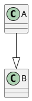
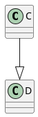
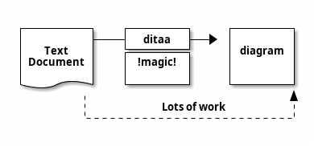
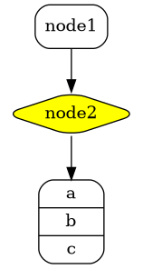

# Chapter 1

## Some text
```python
def a():
    pass
```

## Some text



## Some more text



## Error, forgot @startuml @enduml block (shell error only)

```plantuml
C --|> D
```

## Error in PlantUML diagram source

```plantuml
@startuml
C --|>
@enduml
```

## Ditaa support


## Graphviz diagram support
