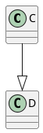
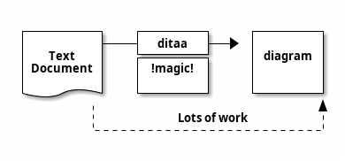
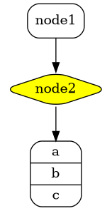

# Chapter 1

## MathJax
\\( \int x dx = \frac{x^2}{2} + C \\)

## A code block with another info string (python)
```python
def a():
    pass
```

## Some text


## Some more text



## Error, forgot @startuml @enduml block (shell error only)

```plantuml
C --|> D
```

## Error in PlantUML diagram source

```plantuml
@startuml
C --|>
@enduml
```

## Ditaa support


## Graphviz diagram support


## More MathJax
To make sure we do not modify it further in the document.

\\( \int x dx = \frac{x^2}{2} + C \\)

## With tildes
~~~plantuml
@startuml
Alice -> Bob: Authentication Request
Bob --> Alice: Authentication Response

Alice -> Bob: Another authentication Request
Alice <-- Bob: Another authentication Response
@enduml
~~~

## With 3 space indent and tildes
   ~~~plantuml
   @startuml
   Alice -> Bob: Authentication Request
   Bob --> Alice: Authentication Response
   
   Alice -> Bob: Another authentication Request
   Alice <-- Bob: Another authentication Response
   @enduml
   ~~~

## 4 space indent is considered unfenced code block (not rendered)
    ~~~plantuml
    @startuml
    Alice -> Bob: Authentication Request
    Bob --> Alice: Authentication Response
    
    Alice -> Bob: Another authentication Request
    Alice <-- Bob: Another authentication Response
    @enduml
    ~~~
