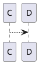

# Output formats

## Text output

```plantuml,format=txt
@startuml
C --> D
@enduml
```

## UTF-8 Text output

```plantuml,format=utxt
@startuml
C --> D
@enduml
```

## PNG output

```plantuml,format=png
@startuml
C --|> D
@enduml
```

## Braille output

```plantuml,format=braille
@startuml
C --|> D
@enduml
```

## Unknown output error

```plantuml,format=chuck
@startuml
C --|> D
@enduml
```
