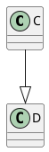

# Output formats

## Text output


## UTF-8 Text output
Only works on shell, web server renders ```txt``` format as utf8 and fails for utf8 format (strangely enough)


## PNG output



## Braille output
Only works on shell


## Inlined SVG with a link


## Unknown output error (defaults to png on shell and error in server)


