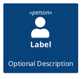

# Includes

These only work for the shell backends in piped mode.

## The following diagram uses the PlantUML `!include` directive
```plantuml
@startuml
!include include.puml
@enduml
```

## The following diagram uses the PlantUML `!includesub` directive
```plantuml
@startuml
!includesub includesub.puml!BASIC
@enduml
```

## The following diagram uses stdlib sprites


