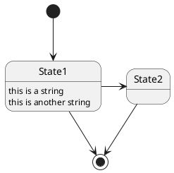
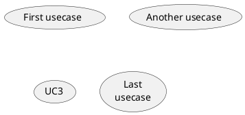

# A nested chapter

## Some text

```plantuml
@startuml

[*] --> State1
State1 --> [*]
State1 : this is a string
State1 : this is another string

State1 -> State2
State2 --> [*]

@enduml
```

## Some more text

```plantuml
@startuml

(First usecase)
(Another usecase) as (UC2)  
usecase UC3
usecase (Last\nusecase) as UC4

@enduml
```
