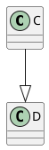
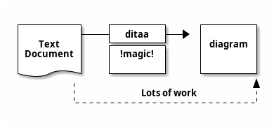
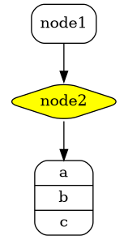

# Chapter 1

Some text

```plantuml
@startuml
A --|> B
@enduml
```

Some more text

```plantuml
@startuml
C --|> D
@enduml
```

Error, forgot @startuml @enduml block

```plantuml
C --|> D
```

And some ditaa

```plantuml
@startditaa
+--------+   +-------+    +-------+
|        +---+ ditaa +--> |       |
|  Text  |   +-------+    |diagram|
|Document|   |!magic!|    |       |
|     {d}|   |       |    |       |
+---+----+   +-------+    +-------+
	:                         ^
	|       Lots of work      |
	+-------------------------+
@endditaa
```

And graphviz diagrams

```plantuml
@startdot
digraph foo {
  node [style=rounded]
  node1 [shape=box]
  node2 [fillcolor=yellow, style="rounded,filled", shape=diamond]
  node3 [shape=record, label="{ a | b | c }"]

  node1 -> node2 -> node3
}
@enddot
```